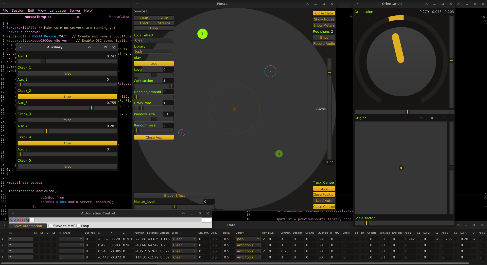

# [Mosca](http://escuta.org/mosca)

[](http://escuta.org/mosca) 

[](https://gitter.im/dev-mosca/community?utm_source=badge&utm_medium=badge&utm_campaign=pr-badge&utm_content=badge)

### note
Installing the ATK [Kernels](http://www.ambisonictoolkit.net/download/kernels) and [Matrices](http://www.ambisonictoolkit.net/download/matrices) is required, as well as the sc3-plugins version 3.10 or higher. For more Library options, you can install this [HOA fork](https://github.com/thibaudk/sc3-plugins)

## DESCRIPTION
Mosca is a SuperCollider class for GUI-assisted production of sound fields with simulated moving or stationary sound sources. Input sources may be any combination of mono, stereo or B-format material and the signals may originate from file, from hardware inputs (physical or from other applications via Jack) or from SuperCollider's own synths. In the case of synth input, each is associated by the user with a particular source in the GUI and registered in a synth registry. This way, they are spatialised by the GUI and also receive data from the GUI pertaining to the source (eg. x, y and z coordinates or auxiliary fader data). Ambisonic Sound fields may be decoded using a variety of built-in decoders (including binaural), Faust Ugens created with the AmbiDecodertoolbox (see [HOA decoding](https://github.com/florian-grond/SC-HOA/blob/master/HelpSource/Tutorials/Exercise_09_HOA_interfacing_VBAP_and_Ambisonics.schelp)) or with external decoders such as Ambdec. Mosca has its own transport provided by the [Automation quark](https://github.com/neeels/Automation) for recording and playback of source data. This can be used independently or may be synchronised to a DAW using Midi Machine Control (MMC) messages. This function has been tested to work with Ardour and Jack. The integration of [ossia-sclang](https://github.com/OSSIA/ossia-sclang) also allows Mosca's individual parameters to be controled with the interactive sequencer [ossia-score](https://ossia.io):: as well as any other application featuring OSCQuerry or plain OSC communication.

### Sources
Mono and stereo sources may be spatialized with ugens from a selection of libraries (Ambitools, HoaLib, ADT, ATK, BF-FMH, Josh & VBAP) set indiviualy for each source. For B-format input signals, which are already ambisonically encoded, the available options for transformation the ATK and Abitools. The ATK is used to implement push transformations to manipulate the angular location of sources as well as to perform rotations of the source sound field and to manipulate its directivity. Ambitools is used to implement a beam formation technique. All sources are subject to high frequency attenuation with distance. For a better sensation of nearness, ATK implements a proximity effect, adding a bass boost to proximal sources among other phase effects to simulate wave curvature. To that same effect, the Ambitools encoder makes use of "Near Field Compensation". Generally, the differences between libraries can be summarised as follows:

| Libraries | specifics                              |
|-----------|----------------------------------------|
| Ambitools | most realistic but CPU demanding       |
| HoaLib    | lightweight and neutral sounding       |
| ADT       | lightweight and broad sounding         |
| SC-HOA    | even lighter                           |
| ATK       | 1st order only but many options        |
| BF-FMH    | 2nd order max                          |
| Josh      | 1st order granular effect              |
| VBAP      | light and precise but less homogeneous |

#### note
The results of any particular spatialisation library are often dependant on the source material. ADT and ATK may be more suited to wide and deep immersive sounds where more focussed, narrow sounds may be better located by the listener with VBAP.

### Reverberation
Reverberation is performed either using a B-format tail room impulse responses (RIRs) or by using reverberators crated with SuperCollider's AllpassC and FreeVerb ugens. With both options, two reverberation level controls are included in the GUI for setting close and distant levels. "Close" reverberation in this case is "global" and is audible by the listener from all directions when the source is close. As it is global, it's type is applied to the entire scene. "Distant" reverb on the other hand is "local" in scope and selected and applied on a per-source basis. It is processed by the individually selected spatialiser along with the dry signal. This effect predominates as the source becomes more distant. For ambisonic signals, the "Close" reverberation may be described as a "2nd order diffuse A-format reverberation". This technique produces reverberation weighted in the direction of sound events and involves conversion to and from A-format in order to apply the effect (ANDERSON). The encoded 2nd order ambisonic signal is converted to a 12-channel A-format signal and then either:

* convolved with a B-format RIR which has been "upsampled" to 2nd order and converted to A-format impulse spectrum
* passed through Freeverb or allpass ugens before being converted back to a 2nd order B-format diffuse signal

For non-ambisonic signals, spatialised with VBAP, a part of the original source signal is mixed with the W component of the B-format reverb input for an omnidirectional effect. These options are drawing from John Chowning's technique of applying "local" and "global" reverberation to sources (CHOWNING)

#### note
Please remember that this diffuse reverberation process, especially with large impulse responses, may require the user to increase the audio buffer size, thus adding more latency.

## Additional Features
Additional features include a scalable Doppler Effect on moving sources, the looping of sources loaded or streamed from file and the adjustment of the virtual loudspeaker angle for stereo sources. Further, a "contraction" control enables crossfades between B-format signals and their raw W component. In the case B-format input signals the contraction changes the sound from having omnidirectional characteristics to becoming a focussed point source. When using the ATK in the case as mono or stereo input sources (the latter of which are treated as two mono sources with adjustable angle from one another) with the ATK, a de-contraction of the focussed source will render it omnidirectional.

Mosca supports methods for making "A-format inserts" on any source spatialised in the
GUI. In this way, the user may write a filtering synth and apply it to the sound without
disrupting the encoded spatial characteristics. Please see the
[guide](HelpSource/Guide/guide-Mosca) for examples.

Additionally, Mosca v0.2 implements headtracking with the Arduino 9-axes Motion Shield
and an appropriate Arduino board such as an Uno. 


Mosca may also run GUI-free and has a
mechanism for coded control of the interface (Setup example in the [guide](HelpSource/Guide/guide-Mosca).

## Begginer tips to install from scratch

If you are a linux user on a debian like distro, this [script](https://github.com/scrime-u-bordeaux/scrimpt) can help you build supercollider and it's plugins from source, and install atk kernels and matrices, among many other things.

For Mac or PC, first install [git](https://git-scm.com/downloads) with a binary installer if you are not confortable with the comand line.

Secondly, install [supercollider](https://supercollider.github.io/download).

Start supercollider (scide), open the "Language" tab and click on "Quarks"

Find the "Mosca" quark in the list and select it, this is where you can find ou if git was installed corectly:  
Check Supercollider's "Post window" for errors.  
If evrything installs correctly, great ! continue on.  
If the post window displays error messages, continue on and apply the **_Workaround_**.

Enter the folowing line in supercerllodier and evaluate it to open the extension folder.
```
Platform.userExtensionDir.openOS
```

Download the [sc3-Plugins](https://github.com/supercollider/sc3-plugins/releases/latest) and decompress them in the extension folder previously opened.

**_workaround (only if errors occured with quarks and git isn't properly installed)  
Return to the extension folder previously opened to decompress the sc3-Plugins.
Download the folowing repositories with these links:  
[Mosca](https://github.com/escuta/mosca/archive/master.zip)  
[MathLib](https://github.com/supercollider-quarks/MathLib/archive/master.zip)  
[Automation](https://github.com/neeels/Automation/archive/master.zip)  
[atk-sc3](https://github.com/ambisonictoolkit/atk-sc3/archive/master.zip)  
[SC-HOA](https://github.com/florian-grond/SC-HOA/archive/master.zip)  
[OSSIA](https://github.com/ossia/ossia-sclang/archive/master.zip)  
Decompress all of them in the same extension directoy as the sc3-Plugins_**

Next, in the code editor of supercollider, recompile the Class Library wih the keyboard shortcut Ctl+Maj+L (on Mac use Command instead of Ctl)
This is a very useful shortcut that alows you to fully reinitialize you session, I recomend remebering it ! 

Finaly, evaluate the folowing code to open the ATK support Directory.
```
(
Atk.createUserSupportDir;
Atk.openUserSupportDir;
) 
```
Download ATK [Matrices](https://github.com/ambisonictoolkit/atk-kernels/releases/latest)  
and ATK [Kernels](https://github.com/ambisonictoolkit/atk-matrices/releases/latest)  
and decompress both repositories in the ATK support Directory. 

## Acknowledgments

The class makes extensive use of the
[Ambisonic Toolkit](http://www.ambisonictoolkit.net) (ATK)
by Joseph Anderson as well as Florian Grond's
[SC-HOA](https://github.com/florian-grond/SC-HOA), based on
[Ambitools](https://github.com/sekisushai/ambitools) by
Pierre Lecompte, the [faust](https://github.com/CICM/HoaLibrary-Faust) version of
the [HoaLibrary](http://hoalibrary.mshparisnord.fr/en) by Pierre Guillot, the
[AmbiDecoderToolbox](https://bitbucket.org/ambidecodertoolbox/adt/src/master) and
sevral other supercollider pluggins for spatial renderding.
Augmented controll has been granted by the integrating the
[Automation quark](https://github.com/neeels/Automation) by Neels Hofmeyr
and [ossia-sclang](https://github.com/OSSIA/ossia-sclang), made possible by [Pierre Cochard](https://github.com/pchdev),
[Jean-Michaël Celerier](https://github.com/jcelerier) and the
[OSSIA Team](https://github.com/OSSIA).

Many thanks to Joseph Anderson, Neels Hofmeyr and members of the SuperCollider list for
their assistance and valuable suggestions.

## References

* [Mott, Iain & Keller, Thibaud. Three-dimensional sound design with Mosca.
18º Encontro Internacional de Arte e Tecnologia / #18.Art Da admirável ordem das coisas: arte emoção e tecnologia, 
Portugal: October 2019](https://www.researchgate.net/publication/336983923_Three-dimensional_sound_design_with_Mosca)

* [Celerier, Jean-Michaël. Authoring interactive media : a logical & temporal
approach.
Ph. D dissertations, University of Bordeaux,
France: 2018](https://www.researchgate.net/publication/329503488_Authoring_interactive_media_a_logical_temporal_approach)

* [Grond, Florian & Lecompte, Pierre. Higher Order Ambisonics for
SuperCollider.
Linux Audio Conference, Jean MONNET University. Saint-Etienne
France: 2017](https://musinf.univ-st-etienne.fr/lac2017/pdfs/13_C_D_141345N.pdf)

* [Anderson, Joseph. Authoring complex Ambisonic soundfields:
An artist's tips & tricks.
DIGITAL HYBRIDITY AND SOUNDS IN SPACE JOINT SYMPOSIUM. University of Derby,
UK: 2011](https://www.researchgate.net/publication/273944382_Authoring_complex_Ambisonic_soundfields_An_artist's_tips_tricks)

* [Chowning, John M. The Simulation of Moving Sound Sources.
Computer Music Journal, v. 1,
n. 3, p. 48-52, 1977](https://www.aes.org/e-lib/browse.cfm?elib=2220)
